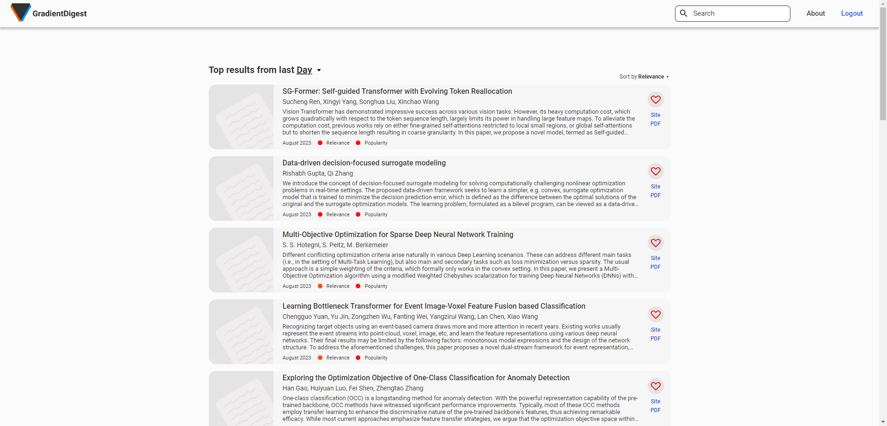
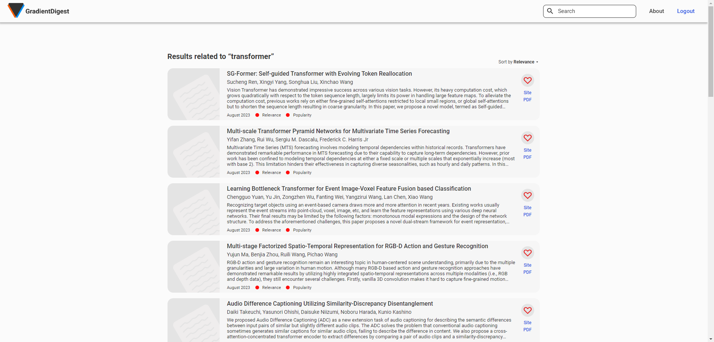
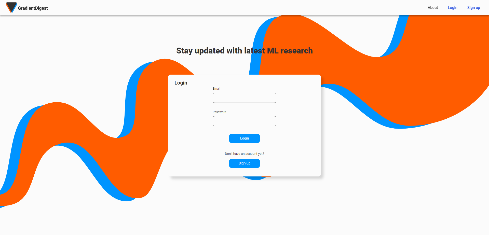
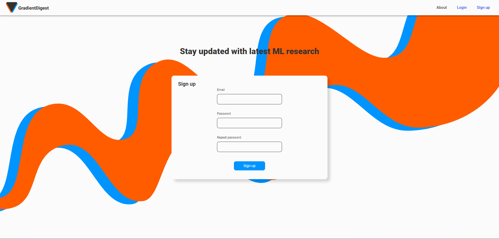
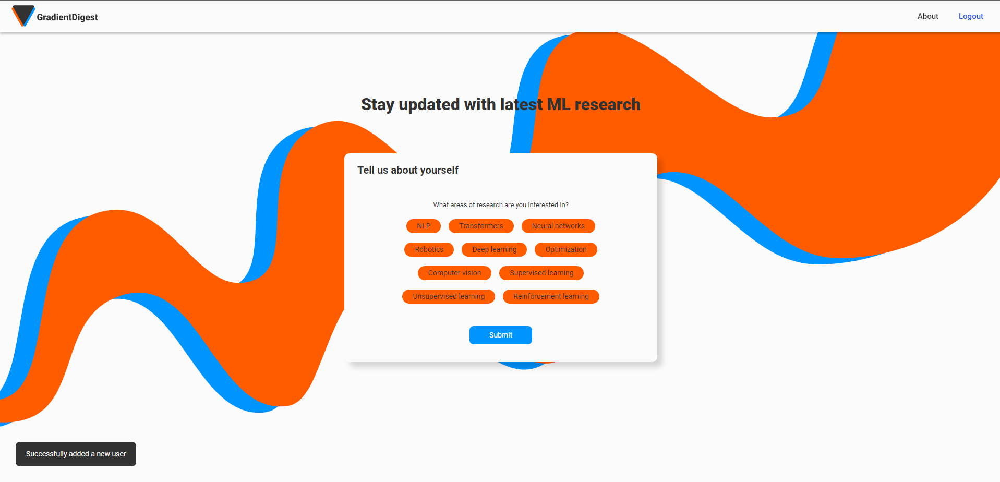

# Overview
This is a simple vector space recommender system based on td-idf that retrieves the most recent AI/machine learning papers from the arXiv website and sorts them by their similarity to the papers that you've liked. Project inspired by [Andrej Karpathy's](https://github.com/karpathy) [arxiv-sanity-lite](https://arxiv-sanity-lite.com/) and this [paper](https://users.ics.forth.gr/~potamias/mlnia/paper_6.pdf).
# Architecture
The profile vectors are computed from the PDFs of the papers rather than just their abstracts. The background scheduler sends requests to the arXiv API every 24 hours, bacause the review process operates in daily cycles. Users' profile vectors are updated with a fixed constant when a new paper is liked. The website is powered by Flask, and uses [scikit-learn](https://scikit-learn.org/stable/) for td-idf computations.   
# Upcoming updates
- Email newsletter
- Summarizing papers with generative AI
- Finding similar articles
- Reading lists
# Photos
### Home Page

### Search Page

### Login Page

### Sign Up Page

### Interests Page

